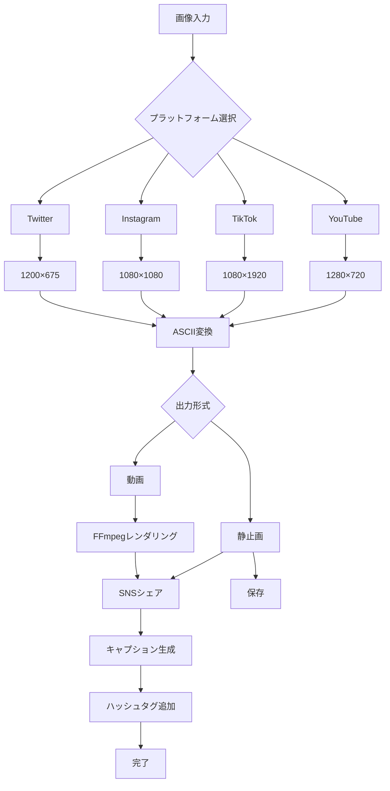

# ASCII Art Generator 高活用化計画

## 対象ペルソナ
**コンテンツクリエイター**（YouTube、TikTokサムネイル、SNS映え目的）

---

## 現状分析

### 既存の強み
- 画像→アスキーアート変換機能（完成）
- 複数キャラクターセット対応
- カラー/モノクロ切り替え
- アップスケール機能
- クリップボードコピー/ファイル保存

### 現状の課題
- SNS投稿に最適化されていない
- プラットフォーム別尺寸プリセットがない
- キャプション/ハッシュタグ生成機能がない
- 動画出力機能がない
- UIがコンテンツクリエイター向けでない

---

## 機能拡張ロードマップ

### 🚀 Phase 1: SNS最適化機能（Week 1-2）

#### 1.1 プラットフォーム別プリセット
```
┌─────────────────────────────────────────────────────┐
│ プラットフォーム別サイズプリセット                    │
├─────────────────────────────────────────────────────┤
│ YouTubeサムネ: 1280×720 (16:9)                      │
│ Twitter/X: 1200×675 (16:9) / 1080×1080 (1:1)        │
│ Instagram: 1080×1080 (1:1) / 1080×1350 (4:5)        │
│ TikTok: 1080×1920 (9:16)                           │
│ Facebook: 1200×630 (1.91:1)                        │
│ LinkedIn: 1200×627 (1.91:1)                        │
└─────────────────────────────────────────────────────┘
```

#### 1.2 キャプション自動生成
```javascript
// AI驅動ハッシュタグ・キャプション生成
const platformCaptions = {
  tiktok: "🏆 この変換、見事です...\n#asciart #digitalart #creative #art",
  youtube: "アスキーアート変換の奥深さ 🎨\n\n高精彩アスキーアートジェネレーター\n#アスキーアート #デジタルアート",
  instagram: "アスキーアート、最新技術 🚀\n.\n.\n保存して今すぐ試そう 📌\n.\n#asciart #generativeart #digitalart #creativecoding #art",
  twitter: "このアスキーアート変換ツール、超絶では...? 🎨\n\n#アスキーアート #クリエイティブ"
};
```

#### 1.3 SNSシェア機能
```javascript
// SNSプラットフォームへの直接シェア
const sharePlatforms = {
  twitter: { url: "twitter.com/intent/tweet", params: ["text", "url"] },
  facebook: { url: "facebook.com/sharer/sharer.php", params: ["u"] },
  line: { url: "social-plugins.line.me/lineit/share", params: ["url", "text"] }
};
```

---

### 🎨 Phase 2: UI/UX改善（Week 2-3）

#### 2.1 レスポンシブレイアウト
```css
/* プラットフォーム別レイアウト */
@media (aspect-ratio: 16/9) {
  /* YouTube, Twitter, Facebook */
  .output-container { max-width: 1280px; }
}

@media (aspect-ratio: 9/16) {
  /* TikTok, YouTube Shorts */
  .output-container { max-width: 1080px; }
}

@media (aspect-ratio: 1/1) {
  /* Instagram */
  .output-container { max-width: 1080px; }
}
```

#### 2.2 プレビュー機能強化
```javascript
// リアルタイムプレビュー
function updatePreview(platform) {
  const dimensions = getPlatformDimensions(platform);
  const scale = Math.min(
    dimensions.width / baseWidth,
    dimensions.height / baseHeight
  );
  
  // アスペクト比を維持したままスケーリング
  previewCanvas.style.transform = `scale(${scale})`;
  previewCanvas.style.aspectRatio = `${dimensions.width}/${dimensions.height}`;
}
```

#### 2.3 テーマ・スタイルオプション
```javascript
const stylePresets = {
  modern: { gradient: "linear-gradient(135deg, #667eea, #764ba2)" },
  retro: { gradient: "linear-gradient(135deg, #f093fb, #f5576c)" },
  monochrome: { gradient: "linear-gradient(135deg, #2d3436, #000000)" },
  neon: { gradient: "linear-gradient(135deg, #00f260, #0575e6)" }
};
```

---

### 🎬 Phase 3: 動画自动化連携（Week 3-4）

#### 3.1 動画フレーム生成
```javascript
// 複数フレームから動画フレームシーケンス生成
async function generateVideoFrames(asciiArt, frameCount) {
  const frames = [];
  for (let i = 0; i < frameCount; i++) {
    const frame = await renderFrame(asciiArt, i, frameCount);
    frames.push(frame);
  }
  return frames;
}

// FFmpeg驅動動画生成
async function createVideo(frames, fps = 30) {
  const ffmpegCommand = `
    ffmpeg -framerate ${fps} -i frame_%04d.png 
    -c:v libx264 -pix_fmt yuv420p output.mp4
  `;
  return executeFFmpeg(ffmpegCommand);
}
```

#### 3.2 アニメーションオプション
```javascript
const animationTypes = {
  fade: { duration: 1000, type: "opacity" },
  slide: { duration: 500, direction: "left" },
  typewriter: { charDelay: 50, lineDelay: 200 },
  pulse: { scale: [1, 1.05, 1], duration: 800 }
};
```

#### 3.3 動画ワークフロー
```
┌──────────────┐    ┌──────────────┐    ┌──────────────┐
│ 画像入力     │───▶│ ASCII変換    │───▶│ アニメ追加   │
└──────────────┘    └──────────────┘    └──────────────┘
                                              │
                                              ▼
                    ┌──────────────┐    ┌──────────────┐
                    │ FFmpeg        │◀───│ 動画レンダリング│
                    └──────────────┘    └──────────────┘
```

---

### 📊 Phase 4: 分析・最適化（Week 4-5）

#### 4.1 コンテンツ分析
```javascript
const analytics = {
  dimensions: {
    width: "出力幅",
    height: "出力高さ", 
    aspectRatio: "アスペクト比"
  },
  performance: {
    charCount: "キャラクター数",
    processingTime: "処理時間",
    fileSize: "ファイルサイズ"
  },
  optimization: {
    recommendedPreset: "推奨プリセット",
    compressionLevel: "圧縮レベル"
  }
};
```

#### 4.2 A/Bテスト対応
```javascript
// コンテンツ効果を測定
const testVariants = {
  color: ["full-color", "grayscale", "high-contrast"],
  style: ["modern", "retro", "minimal"],
  size: ["thumbnail", "full-width", "custom"]
};
```

---

## 実装優先順位マトリックス

### 🚀 インパクト × 実装コスト

```
                    低コスト                高コスト
              ┌────────────────────┬────────────────────┐
        高    │ ★★★★★              │ ★★★★☆              │
      インパク│ • SNSプリセット     │ • AIキャプション   │
        ト    │ • シェアボタン     │ • 動画生成         │
              ├────────────────────┼────────────────────┤
        低    │ ★★★☆☆              │ ★★☆☆☆              │
      イ│ • UI改善             │ • フル機能統合     │
        ト    │ • プレビュー改善   │ • アニメーション   │
              └────────────────────┴────────────────────┘
```

---

## Mermaid ワークフロー図

### コンテンツクリエイター向けワークフロー



---

## 技術スタック

### フロントエンド
- **HTML/CSS/JavaScript** (既存維持)
- **Canvas API** (動画フレーム生成)
- **Web Workers** (並列処理)

### バックエンド
- **Node.js** (サーバーサイド)
- **FFmpeg** (動画処理)
- **Sharp** (画像処理)

### API/サービス
- **OpenAI API** (キャプション生成)
- **Cloudflare R2** (メディアストレージ)

---

## KPI設定

### コンテンツクリエイター向け指標

| 指標 | 目標 | 測定方法 |
|------|------|---------|
| ページ滞在時間 | +40% | Analytics |
| SNSシェア率 | +25% | ソーシャル解析 |
| 動画ダウンロード | +50% | ダウンロード数 |
| ユーザー満足度 | 4.5/5 | フィードバック |
| リピーター率 | +30% | ユーザー行動 |

---

## 次のステップ

1. **Phase 1実装開始** - SNSプリセット + シェア機能
2. **UI改善** - レスポンシブ対応
3. **動画機能追加** - FFmpeg統合
4. **AI統合** - キャプション自動生成

---

## 備考

- アスペクト比維持: ✅ **対応可能**（CSS scale + aspect-ratio）
- 全プラットフォーム対応: ✅ **対応可能**
- 動画・静止画両対応: ✅ **対応可能**
- バランス維持拡大縮小: ✅ **対応可能**